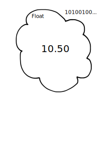
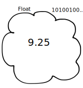
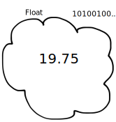
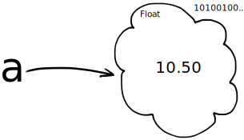

<!doctype html>
<html lang="en" class="no-js">
  <head>
    <meta charset="utf-8">

<!-- begin _includes/seo.html --><title>Coding for Data - 2019 edition</title>
<meta name="description" content="">


<meta property="og:type" content="website">
<meta property="og:locale" content="en_UK">
<meta property="og:site_name" content="Coding for Data - 2019 edition">
<meta property="og:title" content="Coding for Data - 2019 edition">
<meta property="og:url" content="https://matthew-brett.github.io/cfd2019/notebooks/02/variables_intro.Rmd">


  

  


<link rel="canonical" href="https://matthew-brett.github.io/cfd2019/notebooks/02/variables_intro.Rmd">


  <script type="application/ld+json">
    {
      "@context": "http://schema.org",
      "@type": "Person",
      "name": "Matthew Brett",
      "url": "https://matthew-brett.github.io/cfd2019",
      "sameAs": null
    }
  </script>


<!-- end _includes/seo.html -->


<link href="/cfd2019/feed.xml" type="application/atom+xml" rel="alternate" title="Coding for Data - 2019 edition Feed">

<!-- http://t.co/dKP3o1e -->
<meta name="HandheldFriendly" content="True">
<meta name="MobileOptimized" content="320">
<meta name="viewport" content="width=device-width, initial-scale=1.0">

<script>
  document.documentElement.className = document.documentElement.className.replace(/\bno-js\b/g, '') + ' js ';
</script>

<!-- For all browsers -->
<link rel="stylesheet" href="/cfd2019/assets/css/main.css">

<!--[if lte IE 9]>
  <style>
    /* old IE unsupported flexbox fixes */
    .greedy-nav .site-title {
      padding-right: 3em;
    }
    .greedy-nav button {
      position: absolute;
      top: 0;
      right: 0;
      height: 100%;
    }
  </style>
<![endif]-->


    <!-- start custom head snippets -->


<!-- end custom head snippets -->

    <link rel="stylesheet" href="/cfd2019/assets/css/notebook-markdown.css">
    <link rel="stylesheet" href="/cfd2019/assets/css/custom.css">
    <link rel="shortcut icon" type="image/png" href="/cfd2019/favicon.png">
    <script src="https://cdn.jsdelivr.net/npm/clipboard@1/dist/clipboard.min.js"></script>
    <script src="https://cdnjs.cloudflare.com/ajax/libs/anchor-js/4.1.1/anchor.min.js"></script>
  </head>

  <body class="layout--single">

    <!--[if lt IE 9]>
<div class="notice--danger align-center" style="margin: 0;">You are using an <strong>outdated</strong> browser. Please <a href="https://browsehappy.com/">upgrade your browser</a> to improve your experience.</div>
<![endif]-->

    
    <div class="masthead">
  <div class="masthead__inner-wrap">
    <div class="masthead__menu">
      <nav id="site-nav" class="greedy-nav">
        <a class="site-title" href="/cfd2019/">
          
          Coding for Data - 2019 edition
        </a>
        <ul class="visible-links">
          
            
            <li class="masthead__menu-item">
              <a href="https://matthew-brett.github.io/cfd2019/about" >About</a>
            </li>
          
            
            <li class="masthead__menu-item">
              <a href="https://matthew-brett.github.io/cfd2019/syllabus" >Syllabus</a>
            </li>
          
            
            <li class="masthead__menu-item">
              <a href="https://matthew-brett.github.io/cfd2019/classes" >Classes</a>
            </li>
          
          
            <li class="masthead__menu-item">
              <a href="/cfd2019/chapters/01/intro">Textbook</a>
            </li>
          
          
        </ul>
        
        <button class="search__toggle" type="button">
          <svg class="icon" width="16" height="16" xmlns="http://www.w3.org/2000/svg" viewBox="0 0 15.99 16">
            <path d="M15.5,13.12L13.19,10.8a1.69,1.69,0,0,0-1.28-.55l-0.06-.06A6.5,6.5,0,0,0,5.77,0,6.5,6.5,0,0,0,2.46,11.59a6.47,6.47,0,0,0,7.74.26l0.05,0.05a1.65,1.65,0,0,0,.5,1.24l2.38,2.38A1.68,1.68,0,0,0,15.5,13.12ZM6.4,2A4.41,4.41,0,1,1,2,6.4,4.43,4.43,0,0,1,6.4,2Z" transform="translate(-.01)"></path>
          </svg>
        </button>
        
        <button class="greedy-nav__toggle hidden" type="button">
          <span class="visually-hidden">Toggle Menu</span>
          <div class="navicon"></div>
        </button>
        <ul class="hidden-links hidden"></ul>
      </nav>
    </div>
  </div>
</div>

    

    <div class="initial-content">
      


<div id="main" role="main">
  

  <article class="page" itemscope itemtype="http://schema.org/CreativeWork">
    
    
    
    

    <div class="page__inner-wrap">
      
        <header>
          <!--  -->
          
        </header>
      

      <section class="page__content" itemprop="text">
        
        Remember the problem in [the first notebook](../01/using_jupyter).

Alex and Billie are at a restaurant, getting ready to order. They don't have much money, so they are calculating their expected bill before they order.

Alex is thinking of having the fish for £10.50, and Billie is leaning towards the chicken, at £9.25.  They also want to add a tip of 15%.

Here's the calculation for the tip.

```{python}
# The bill plus tip - mistake fixed.
(10.50 + 9.25) * 0.15
```

We then had to add this to the total before tip, to get the grand total:

```{python}
# The bill, including the tip
10.50 + 9.25 + (10.50 + 9.25) * 0.15
```

But - what if Alex changes her mind, and wants to have the aubergine gratin, for £8.95?  We have to type the whole calculation out again, but change the previous £10.50 (the fish) to the current £8.95 (the aubergine), like this:


```{python}
# The bill, including the tip, with Alex having aubergine.
8.95 + 9.25 + (8.95 + 9.25) * 0.15
```

We would like a way to give labels to these numbers, to make our calculations easier to read, and easier to repeat.

We need *variables*.

## An interlude - thinking like the computer.

Remember when we calculated the total bill before tip:

```{python}
# Total bill, before tip.
10.50 + 9.25
```

To recap, when you run this code (by typing Shift-Enter) Python makes its own
representation of `10.50`:



It also makes its own representation of `9.25`:



Python then runs the *addition* operation on these two, which results in
Python's representation of `19.75`.



Finally, Python sends back the `19.75`.  The notebook detects that Python sent
back a value, and shows it to us.

## Variables

Now consider this:

```{python}
a = 10.50
b = 9.25
a + b
```

The first two lines in the cell above are *assignment statements*.

Let's consider the first line.

```{python}
a = 10.50
```

Like all assignment statements, this assignment statement has two parts, and
these are (wait for it):

* The left hand side (to the left of the equals sign `=`).
* The right hand side (to the right of the equals sign `=`).

In our case:

* The Left Hand Side (LHS) is `a`.
* The Right Hand Side (RHS) is `10.50`.

What will Python do with this line?

First it works on the RHS, and does what it did before; it makes its own
representation of `10.50`.  This thing that it made is a *value*.  (We could
also call it an *object*, but don't worry about that for now).

Next it looks at the LHS, and sees `a`.  It realizes that this is a *name* that we want to give the new *value*.  Then it stores the new value 10.50 with the label `a`, in its *workspace*. Next time we use the label `a` Python will look in its workspace for the label `a`, it will find 10.50, and return it to us.



You can read `a = 10.50` as:

> 'a' gets the value 10.50

Here we just run the same line again, but with a comment to remind us what is
happening:

```{python}
# 'a' gets the value 10.50
a = 10.50
```

Let's use the new label `a` by putting it on a line on its own, in a code cell.

```{python}
# Show the value of "a"
a
```

What happened here?

Remember that, when Python sees the label `a` it will look in its workspace for `a`.  If it finds `a`, it will return the value for `a`.  This is 10.50.  Finally, Jupyter makes the value 10.50 into something it can print to show us, and we see `10.50`.

Now we go back to the original three lines.  Run this cell:

```{python}
# Set 'a' and 'b', then show the result of adding 'a' and 'b'.
a = 10.50
b = 9.25
a + b
```

We read the first two lines as:

* 'a' gets the value 10.50.
* 'b' gets the value 9.25.
* Calculate 'a + b' and show the result.

The second line tells Python that is should give the label `b` to the value 9.25.


What is happening in the third line `a + b`?

Python sees `a`, and replaces it with the value for `a`: its own representation of the number 10.50.

Then it sees `b` and replaces it with the value for `b`: its own representation of the number 9.25.

Noting the `+` it then calculates the result of adding the value 10.50 to the value 9.25, and this generates a new value, 19.75.

Finally, it makes something we can show on the screen for this value, 19.75, and shows it to us: `19.75`.

So `a + b` ends up with exactly the same calculation, and result, as `10.50 + 9.25`.

## Variables

`a` and `b` above are *variables*.  Variables are labels attached to values.

Here we have used single-letter names for the variables, but we can use
multiple letters in the names.  We can even use the *underscore* character `_`
in the name. Python doesn't care whether the names are single letters, or
multiple letters, it just uses the name as a label to refer to the value.  So
we could write the same calculations like this:

```{python}
# Different, longer names.
alpha = 10.50
beta = 9.25
alpha + beta
```

All this does exactly the same as the cell with the names `a` and `b`, except now the label we use for 10.50 is `alpha` and the label for 9.25 is `beta`.  For example, now the label `alpha` points to the value 10.50:


You will find it very useful to use good variable names.  A good variable name is a name that reminds you what the value represents.  For example, we could write this:

```{python}
# Better variable names
alex_main = 10.50
billie_main = 9.25
alex_main + billie_main
```

Here the names remind us what the values mean.  Python doesn't care though - it just sees a label, it doesn't try and work out what the label means.  We choose good variable names for us, the people reading the program.  Python doesn't care either way.

Finally, we might also put the total into its own variable, like this:

```{python}
# Total gets its own variable.
alex_main = 10.50
billie_main = 9.25
total = alex_main + billie_main
# Show the value attached to the 'total' variable.
total
```

Again, the name `total` is a good one, because it reminds us what the value means, but it is nothing special to Python - we could have called it `bandersnatch` and we would get the same result:

```{python}
# Total variable, with funny name.
alex_main = 10.50
billie_main = 9.25
bandersnatch = alex_main + billie_main
# Show the value attached to the 'bandersnatch' variable.
bandersnatch
```

Putting the total in its own variable allows us to do our original calculation
of the bill plus tip in a rather simple and readable way:

```{python}
# The bill plus tip, again.
total + total * 0.15
```

It also means that we can change our minds about the individual amounts, but still keep the same bit of code.  Here's the calculation of the total and tip, again.

```{python}
# Calculate total and total plus tip, again.
total = alex_main + billie_main
# Calculate and show the result.
total + total * 0.15
```

Now Alex has changed her mind, all we need to do is change her variable:

```{python}
# Alex wants the aubergine gratin.
alex_main = 8.95
```

Now re-run the cell above - what do you see?

## End note

Variables are the heart of coding.  By using good variable names, we can write down our calculations in a way that is easy to understand.  We can make calculations more general, and therefore more useful, but using variables instead of values like `10.50`, so that the calculation works for any valid number, that we put into the variable.

        
      </section>

      <footer class="page__meta">
        
        


        
      </footer>

      

      

    </div>

    
  </article>

  
  
</div>

    </div>

    
      <div class="search-content">
        <div class="search-content__inner-wrap"><input type="text" id="search" class="search-input" tabindex="-1" placeholder="Enter your search term..." />
    <div id="results" class="results"></div></div>
      </div>
    

    

    
  <script src="/cfd2019/assets/js/main.min.js"></script>
  <script src="https://use.fontawesome.com/releases/v5.0.12/js/all.js"></script>


<script src="/cfd2019/assets/js/lunr/lunr.min.js"></script>
<script src="/cfd2019/assets/js/lunr/lunr-store.js"></script>
<script src="/cfd2019/assets/js/lunr/lunr-en.js"></script>


    <!-- Custom scripts to load after site JS is loaded -->

    <!-- Custom HTML used for the textbooks -->
<!-- Configure, then load MathJax -->
<script type="text/javascript">
  window.MathJax = {
    tex2jax: {
      inlineMath: [ ['$','$'], ["\\(","\\)"] ],
      processEscapes: true,
      processEnvironments: true
    }
  };
</script>
<script src="https://cdnjs.cloudflare.com/ajax/libs/mathjax/2.7.0/MathJax.js?config=TeX-AMS-MML_HTMLorMML-full,Safe" type="text/javascript"></script>


<script type="text/javascript">
// --- To auto-embed hub URLs in interact links if given in a RESTful fashion ---
function getJsonFromUrl(url) {
  var query = url.split('?');
  if (query.length < 2) {
    // No queries so just return false
    return false;
  }
  query = query[1];
  // Collect REST params into a dictionary
  var result = {};
  query.split("&").forEach(function(part) {
    var item = part.split("=");
    result[item[0]] = decodeURIComponent(item[1]);
  });
  return result;
}

// Parse a Binder URL, converting it to the string needed for JupyterHub
function binder2Jupyterhub(url) {
  newUrl = {};
  parts = url.split('v2/gh/')[1];
  // Grab the base repo information
  repoinfo = parts.split('?')[0];
  var [org, repo, ref] = repoinfo.split('/');
  newUrl['repo'] = ['https://github.com', org, repo].join('/');
  newUrl['branch'] = ref
  // Grab extra parameters passed
  params = getJsonFromUrl(url);
  if (params['filepath'] !== undefined) {
    newUrl['subPath'] = params['filepath']
  }
  return jQuery.param(newUrl);
}

// Filter out potentially unsafe characters to prevent xss
function safeUrl(url)
{
   return String(encodeURIComponent(url))
            .replace(/&/g, '&amp;')
            .replace(/"/g, '&quot;')
            .replace(/'/g, '&#39;')
            .replace(/</g, '&lt;')
            .replace(/>/g, '&gt;');
}

function addParamToInternalLinks(hub) {
  var links = $("a").each(function() {
    var href = this.href;
    // If the link is an internal link...
    if (href.search("https://matthew-brett.github.io") !== -1 || href.startsWith('/') || href.search("127.0.0.1:") !== -1) {
      // Assume we're an internal link, add the hub param to it
      var params = getJsonFromUrl(href);
      if (params !== false) {
        // We have REST params, so append a new one
        params['hub'] = hub;
      } else {
        // Create the REST params
        params = {'hub': hub};
      }
      // Update the link
      var newHref = href.split('?')[0] + '?' + jQuery.param(params);
      this.setAttribute('href', decodeURIComponent(newHref));
    }
  });
  return false;
}

  // Update interact links
function updateInteractLink() {
    // hack to make this work since it expects a ? in the URL
    rest = getJsonFromUrl("?" + location.search.substr(1));
    hubUrl = rest['hub'];
    if (hubUrl !== undefined) {
      // Sanitize the hubUrl
      hubUrl = safeUrl(hubUrl);
      // Add HTTP text if omitted
      if (hubUrl.indexOf('http') < 0) {hubUrl = 'http://' + hubUrl;}
      link = $("a.interact-button")[0];
      if (link !== undefined) {
          // Update the interact link URL
          var href = link.getAttribute('href');
          if ('binder' == 'binder') {
            // If binder links exist, we need to re-work them for jupyterhub
            first = [hubUrl, 'hub', 'user-redirect', 'git-sync'].join('/')
            href = first + '?' + binder2Jupyterhub(href);
          } else {
            // If JupyterHub links, we only need to replace the hub url
            href = href.replace("https://mybinder.org", hubUrl);
          }
          link.setAttribute('href', decodeURIComponent(href));

          // Add text after interact link saying where we're launching
          hubUrlNoHttp = decodeURIComponent(hubUrl).replace('http://', '').replace('https://', '');
          $("a.interact-button").after($('<div class="interact-context">on ' + hubUrlNoHttp + '</div>'));

      }
      // Update internal links so we retain the hub url
      addParamToInternalLinks(hubUrl);
    }
}

// --- Highlight the part of sidebar for current page ---

// helper to replace trailing slash
function replaceSlash(string)
{
    return string.replace(/\/$/, "");
}

// Add a class to the current page in the sidebar
function highlightSidebarCurrentPage()
{
  var currentpage = location.href;
  var links = $('.sidebar .nav__items a');
  var ii = 0;
  for(ii; ii < links.length; ii++) {
    var link = links[ii];
    if(replaceSlash(link.href) == replaceSlash(currentpage)) {
      // Add CSS for styling
      link.classList.add("current");
      // Scroll to this element
      $('div.sidebar').scrollTop(link.offsetTop - 300);
    }
  }
}

// --- Set up copy/paste for code blocks ---
function addCopyButtonToCode(){
  // get all <code> elements
  var allCodeBlocksElements = $( "div.input_area code, div.highlighter-rouge code" );

  allCodeBlocksElements.each(function(ii) {
   	// add different id for each code block

  	// target
    var currentId = "codeblock" + (ii + 1);
    $(this).attr('id', currentId);

    //trigger
    var clipButton = '<button class="btn copybtn" data-clipboard-target="#' + currentId + '"></button>';
       $(this).after(clipButton);
    });

    new Clipboard('.btn');
}

// Run scripts when page is loaded
$(document).ready(function () {
  // Add anchors to H1 etc links
  anchors.add();
  // Highlight current page in sidebar
  highlightSidebarCurrentPage();
  // Add copy button to code blocks
  addCopyButtonToCode();
  // Update the Interact link if a REST param given
  updateInteractLink();
});
</script>

  </body>
</html>
